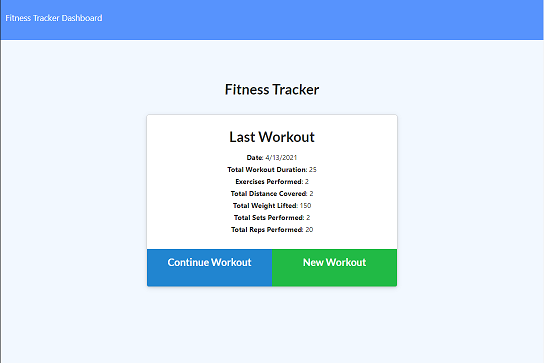
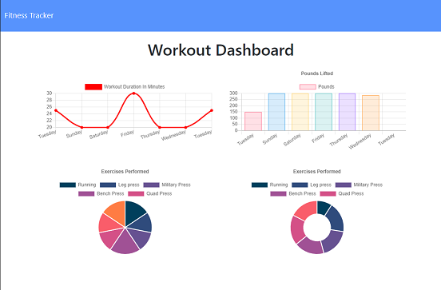

 # Fitness Tracker
  ---
  * [GitHub Repository](https://github.com/MVPeter/WorkoutTracker)

  
      
  ## Table of Contents
    - Discription
    - Installation
    - Usage
    - Contributions
    - Liscense
    - Questions

  ---
  
  ## Discription

  This is an application you can use to track both your cardio and resistance routines.  It can help you also visually see your workout over a 7 day period.  From the main page you can create a new workout and add as many exercise routines you want for the day.  You can return to the main page, use continue workout, and add another exercise to your workout for that day.

  
  

  ---
  
  ## Installation

  npm install  npm run seed requires a Mongo database

  ---
  
  ### Usage

    * Setup a mongo database

  ---
  
  ### Tests

    * none

  
  ### Contributions

    * none

  ---
  
  ### License

    * This project is covered by the following license(s): None
    

  ---
  
  ### Questions
  - GitHub Profile: [GitHub Profile](https://github.com/MVPeter)
  - For further questions please contact me at email:  MVPetersen1@gmail.com

  